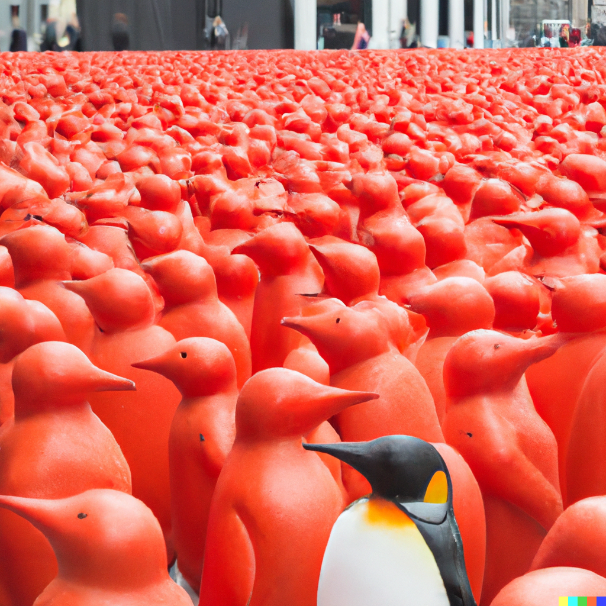
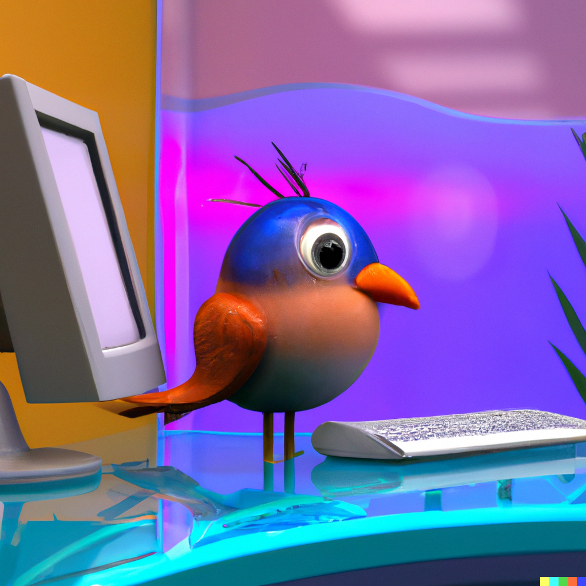

#### Embracing Polymathy: A Personal Odyssey into Interdisciplinary Mastery

Choosing the path of polymathy is a profound exploration of self. While collaboration with experts from diverse domains is undeniably crucial, the essence lies in a more personal revelation.

Within the intricate tapestry of knowledge, understanding oneself becomes the anchor. Navigating through the nuanced gray areas and unraveling complexities requires not only a grasp of various domains but also a deep awareness of personal strengths and limitations.

In this unique journey, the synergy of interdisciplinary expertise and self-discovery is the compass, guiding the polymath through the uncharted territories of comprehensive knowledge. It's not just about mastering diverse fields; it's about an intimate dance between external exploration and internal understanding, creating a truly individualized approach to the pursuit of wisdom.

<figure>
    
    <figcaption>1% Change makes great difference.</figcaption>
</figure>

Learning is the joy of living. Growing up is the reason for my life. Looking for the opportunity to grow together.

---

### My Journey

- **Serve Military Duty in the Special Forces**, instilling in me discipline, resilience, and a profound sense of duty.
- **Adventures in Sydney, Australian**, serviving in Austraila without knowing the language, without money. learning the language and fiding jobs.
- **Volunteer Math Teacher** for students from less fortunate families, a commitment to community.
- **Graduate BSc (Mechanical Engineering) at SKKU (South Korea)**
- **Research Engineer Hyundai Motors**, embracing the transformative potential of data science in car manufacturing.
- **Graduate MSc (Robotics) at RWTH (Germany)**, integrating professional and academics.
- **Deep Aerial Mapper**, Co-authored with the thesis supervisor contributing to both the academic community and practical applications.
- **Zero to One**, My startup swiftly achieved a **$4k MRR** in seven months, testament to our innovative solutions and market fit.
- Laser-focus on **building a business that matters**, exploring collaborative growth opportunities.
- **The entrepreneurial journey** began with the co-foundation of a [startup](https://www.hexafarms.com), selected in [Techstars](https://www.linkedin.com/posts/techstars-berlin_indoorfarms-verticalindoorfarms-foodproduction-activity-6991309954343145472-c1hj?utm_source=share&utm_medium=member_desktop) program and then succeeded in raising 1.3 Million Euros in [pre-seed](https://www.eu-startups.com/2024/05/berlin-based-agtech-hexafarms-secures-e1-3-million-pre-seed-to-empower-commercial-indoor-farmers/).

[My narrative](https://www.worldjob.or.kr/info/bbs/ovseaAdvnStry/view.do?menuId=1000006395&bbscttNo=192537) has been listed as the top story by the Human Resources Development Service of Korea (HRDK). (Published in Korean.)

<figure>
    
    <figcaption>Don't be limited in the well's constraints, let's shape the world.</figcaption>
</figure>