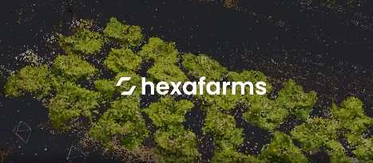
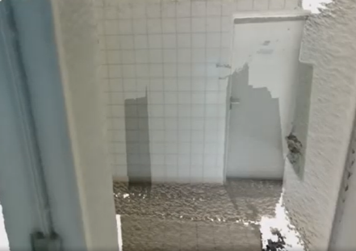
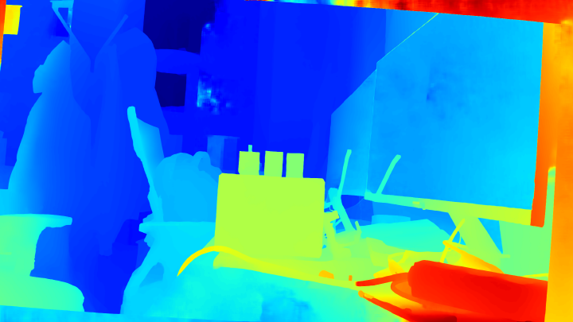
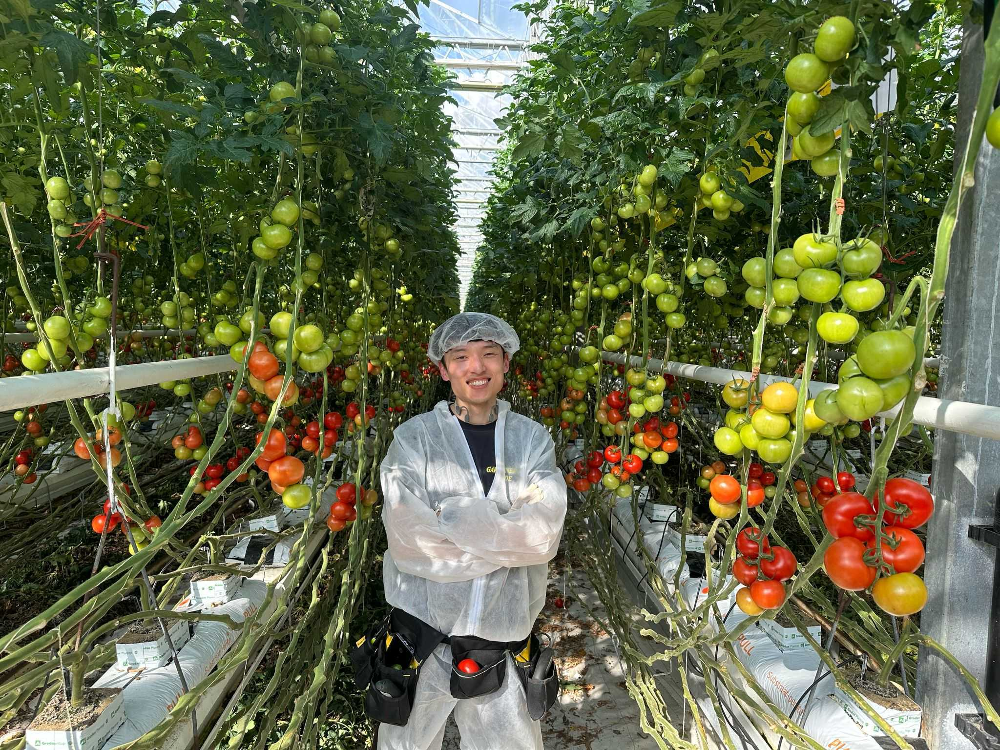

  <!-- Drone Vision -->
  

    
Drone Vision

    
    

      Advanced drone vision system with trajectory planning, object detection, and visual SLAM.
      <ul>
        <li><a href="https://github.com/ccomkhj/tello_ros_drone">Drone control using ROS2</a></li>
        <li><a href="https://github.com/HexaFarms/yolov5">Customized YOLOv5</a></li>
        <li><a href="https://github.com/ccomkhj/ORB_SLAM3">Drone-Visual SLAM in farming</a></li>
        <li><a href="https://github.com/ccomkhj/PCL_Plants">Point Cloud Processing</a></li>
      </ul>
    

    

      Computer Vision
      ROS2
      SLAM
    

  

  <!-- 3D Reconstruction -->
  

    
3D Reconstruction

    
    

      Advanced 3D reconstruction system for creating detailed digital models.
    

    

      Computer Vision
      3D Modeling
      SfM
    

  

  <!-- Stereo Vision -->
  

    
Stereo Vision

    
    

      <ul>
        <li>Build hardware of stereo vision from scratch</li>
        <li>Depth computation</li>
        <li><a href="https://github.com/ccomkhj/Charuco_Stereo_Calibrator">Custom stereo calibration</a></li>
        <li><a href="https://ccomkhj.github.io/StereoVision">Reading</a></li>
      </ul>
    

    

      Computer Vision
      3D Reconstruction
      Depth Estimation
    

  

  <!-- Cancer Detector -->
  

    
Cancer Detector

    

      End-to-end pipeline for multi-class segmentation and classification on prostate MRI data.
      <ul>
        <li>Config-driven modular architecture with layered YAML composition</li>
        <li>Full HPC/SLURM support with sweep/grid search and auto model promotion</li>
        <li>Research runner orchestrating data import through inference</li>
      </ul>
      <a href="https://github.com/ccomkhj/cancer_detector" target="_blank">View on GitHub</a>
    

    

      Deep Learning
      Medical Imaging
      MRI Segmentation
    

  

  <!-- Agent Materialize -->
  

    
Agent Materialize

    

      Foundation layer for agents over Postgres — agent-curated materialized views behind a two-role access boundary.
      <ul>
        <li>Setup + runtime MCP servers; agent never touches base tables</li>
        <li>Access boundary enforced inside Postgres, not the app layer</li>
        <li>Lineage parsed by sqlglot; static HTML dashboard with refresh history</li>
      </ul>
      <a href="https://github.com/ccomkhj/agent_materialize" target="_blank">View on GitHub</a>
    

    

      MCP
      Postgres
      Agent Tools
    

  

  <!-- Agentune -->
  

    
Agentune

    
    

      Agent-driven hyperparameter optimization with Optuna — Claude Code adapts the search strategy round-by-round.
      <ul>
        <li>LLM agent reads round summaries via MCP, proposes search-space changes</li>
        <li>Optuna runs deterministically within each round (XGBoost, LightGBM, CatBoost)</li>
        <li>Auto-generated HTML reports per campaign; Postgres + MLflow backend</li>
      </ul>
    

    

      HPO
      MCP
      Optuna
    

  

  <!-- Polarize -->
  

    
Polarize

    

      Agent-native CLI that discovers compute-heavy pandas operations and validates their Polars conversions.
      <ul>
        <li>AST-based discovery with compute-weight ranking (loop-aware, impact-sorted)</li>
        <li>Validates correctness and benchmarks time/memory improvement</li>
        <li>Structured JSON output designed for autonomous agent loops</li>
      </ul>
      <a href="https://github.com/ccomkhj/polarize" target="_blank">View on GitHub</a>
    

    

      Python
      Pandas-to-Polars
      Agent Tools
    

  

  <!-- Event Inventory Kafra -->
  

    
Event Inventory

    

      Event-driven inventory sync replacing daily batch pulls with near-real-time Shopify webhook updates.
      <ul>
        <li>Shopify webhooks → FastAPI → Kafka (KRaft) → PostgreSQL pipeline</li>
        <li>Idempotent & order-safe with partition-keyed Kafka messages</li>
        <li>Fully containerized with mock webhook generator for local testing</li>
      </ul>
      <a href="https://github.com/ccomkhj/event_inventory_kafra" target="_blank">View on GitHub</a>
    

    

      Kafka
      Event-Driven
      Shopify
    

  

  <!-- Finance Portfolio -->
  

    
Finance Portfolio

    

      Plain-text, git-tracked personal portfolio manager — check, visualize, and rebalance from terminal or dashboard.
      <ul>
        <li>Drift-to-target in one command; EUR-native with auto FX conversion</li>
        <li>Trades live in CSV, targets in YAML; git is the audit trail</li>
        <li>Streamlit dashboard with inline editing; ~500 lines of Python</li>
      </ul>
      <a href="https://github.com/ccomkhj/finance_portfolio" target="_blank">View on GitHub</a>
    

    

      Finance
      CLI
      Streamlit
    

  

## II. Publications

  

    
Master Thesis

    

      Deep Learning-Based Semiautomatic Generation of HD maps from Aerial Imagery
    

    

      Deep Learning
      HD Maps
      Aerial Imagery
    

  

  

    
Deep Aerial Mapper

    

      Research paper on advanced aerial mapping techniques using deep learning.
        
      <a href="https://www.arxiv.org/abs/2410.00769" target="_blank">View Paper</a>
    

    

      Research
      Computer Vision
      arXiv
    

  

<figure>
    
    <figcaption>I enjoy working close to the field and clients. </figcaption>
</figure>