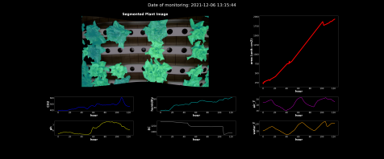

  <h2 class="section-title">Develop technology to make life better</h2>
  
Here is my technology repo. Anyone can use my work. Feel free to use it to help others.

---

  <h2 class="section-title">I. Demo Projects</h2>
  
  

    <!-- Drone Vision Project Card -->
    

      
      

        <h3 class="project-title">Drone Vision</h3>
        

          
Advanced drone vision system with trajectory planning, object detection, and visual SLAM.

          <ul>
            <li><a href="https://github.com/ccomkhj/tello_ros_drone">Drone control using ROS2</a></li>
            <li><a href="https://github.com/HexaFarms/yolov5">Customized YOLOv5</a></li>
            <li><a href="https://github.com/ccomkhj/ORB_SLAM3">Drone-Visual SLAM in farming</a></li>
            <li><a href="https://github.com/ccomkhj/PCL_Plants">Point Cloud Processing</a></li>
          </ul>
          
<i>developed at <a href="https://www.hexafarms.com">hexafarms</a></i>

        

      

      

        Computer Vision
        ROS2
        SLAM
      

    

    <!-- 3D Reconstruction Project Card -->
    

      
      

        <h3 class="project-title">3D Reconstruction</h3>
        

          
Advanced 3D reconstruction system for creating detailed digital models.

          
<i>developed at <a href="https://www.hexafarms.com">hexafarms</a></i>

        

      

      

        Computer Vision
        3D Modeling
        SfM
      

    

    <!-- Data Science Project Card -->
    

      
      

        <h3 class="project-title">Data Science</h3>
        

          
Advanced data science solutions for complex problems.

          <ul>
            <li><a href="https://github.com/HexaFarms/openHexa">Image Segmentation</a></li>
            <li>Data Processing</li>
            <li>Visualization</li>
          </ul>
          
<i>developed at <a href="https://www.hexafarms.com">hexafarms</a></i>

        

      

      

        Data Science
        ML
        Visualization
      

    

  

---

  <h2 class="section-title">II. More Projects</h2>
  
  

    <!-- Image Processing Card -->
    

      
      

        <h3 class="project-title">Image Processing</h3>
        

          <ul>
            <li><a href="https://github.com/HexaFarms/openHexa">Instant Segmentation</a></li>
            <li>Image-tabular data combined Classification</li>
            <li>Time-series analysis for growth</li>
          </ul>
          
<i>developed at <a href="https://www.hexafarms.com">hexafarms</a></i>

        

      

      

        Computer Vision
        Classification
        Segmentation
      

    

    <!-- Web Application Card -->
    

      
      

        <h3 class="project-title">Web Application</h3>
        

          
Sensor and User accounts management system

          <ul>
            <li>Full-stack development</li>
          </ul>
          
<i>developed at <a href="https://www.hexafarms.com">hexafarms</a></i>

        

      

      

        Full-Stack
        Web Development
        UI/UX
      

    

    <!-- LLM Powered Web Chatbot Card -->
    

      
      

        <h3 class="project-title">LLM Powered Web Chatbot</h3>
        

          <ul>
            <li>Natural Language Processing, Word Embedding</li>
            <li>Design Concurrency Functionality</li>
            <li>Prompt Engineering</li>
          </ul>
          
<i>developed at <a href="https://www.hexafarms.com">hexafarms</a></i>

        

      

      

        NLP
        LLM
        AI
      

    

    <!-- MLOps & HyperParameter Tuning Card -->
    

      
      

        <h3 class="project-title">MLOps & HyperParameter Tuning</h3>
        

          <ul>
            <li>Fully Open source-based full MLOps (Version, feature control)</li>
            <li>Hyper parameter tuning with experiment tracking</li>
          </ul>
        

      

      

        MLOps
        Model Tuning
        Experiment Tracking
      

    

    <!-- Time-series Forecast Card -->
    

      
      

        <h3 class="project-title">Time-series Forecast</h3>
        

          <ul>
            <li>Develop domain knowledge-supported custom ML <a href="https://github.com/ccomkhj/constrained-linear-regression">MultiConstrainedLinearRegression</a></li>
            <li>Feature Engineering/Imputation (Transformer/GBT-based, statistic, plant science)</li>
            <li>XAI (Explainable AI) to understand why model performs better or worse</li>
          </ul>
          
<i>developed at <a href="https://www.hexafarms.com">hexafarms</a></i>

        

      

      

        Time Series
        Forecasting
        XAI
      

    

    <!-- Stereo Vision Card -->
    

      
      

        <h3 class="project-title">Stereo Vision</h3>
        

          <ul>
            <li>Build hardware of stereo vision from scratch</li>
            <li>Depth computation</li>
            <li><a href="https://ccomkhj.github.io/StereoVision">Reading</a></li>
          </ul>
          
<i>developed at <a href="https://www.hexafarms.com">hexafarms</a></i>

        

      

      

        Computer Vision
        3D Reconstruction
        Depth Estimation
      

    

  

---

  <h2 class="section-title" id="source-code">II. More Source Codes</h2>
  
  

    <!-- Source Code Card 1 -->
    

      

        <h3 class="project-title">OpenHexa</h3>
        

          
Open-source platform for data management and processing in agriculture.

        

        <a href="https://github.com/HexaFarms/openHexa" class="btn" target="_blank">View on GitHub</a>
      

    

    
    <!-- Source Code Card 2 -->
    

      

        <h3 class="project-title">MultiConstrained LinearRegression</h3>
        

          
Advanced regression algorithms with multiple constraints for scientific applications.

        

        <a href="https://github.com/ccomkhj/constrained-linear-regression" class="btn" target="_blank">View on GitHub</a>
      

    

    
    <!-- Source Code Card 3 -->
    

      

        <h3 class="project-title">Computer Vision Ops</h3>
        

          
Operations and utilities for computer vision applications.

        

        <a href="https://github.com/ccomkhj/cvOps" class="btn" target="_blank">View on GitHub</a>
      

    

    
    <!-- Source Code Card 4 -->
    

      

        <h3 class="project-title">CharucoStereoCalibrator</h3>
        

          
Tool for calibrating stereo camera systems using Charuco boards.

        

        <a href="https://github.com/ccomkhj/Charuco_Stereo_Calibrator" class="btn" target="_blank">View on GitHub</a>
      

    

    
    <!-- Source Code Card 5 -->
    

      

        <h3 class="project-title">Berlin Reservation Bot</h3>
        

          
Automated system for booking appointments with Berlin authorities.

        

        <a href="https://github.com/ccomkhj/berlin-auslaenderbehorde-termin-bot" class="btn" target="_blank">View on GitHub</a>
      

    

    
    <!-- Additional source codes -->
    

      

        <h3 class="project-title">More Projects</h3>
        

          <ul>
            <li><a href="https://github.com/ccomkhj/Pixel_Area">Compute pixel's actual dimension</a></li>
            <li><a href="https://github.com/ccomkhj/YOLO_data_generator">YOLO data generator</a></li>
            <li><a href="https://github.com/ccomkhj/classify_seg_mask">Image classification & mass estimation</a></li>
            <li><a href="https://github.com/ccomkhj/crop_generator">Image cropping tool</a></li>
            <li><a href="https://github.com/HexaFarms/GraphCut">Image Segmentation using Graph-cut</a></li>
            <li><a href="https://github.com/ccomkhj/hyperoptmm/">MLflow-HyperOpt wrapper</a></li>
            <li><a href="https://github.com/ccomkhj/ScienceNote">Science into Code</a></li>
            <li><a href="https://github.com/ccomkhj/datumaro-gui">Datumaro GUI app</a></li>
            <li><a href="https://github.com/ccomkhj/Lightening_Classifier/">Classifier Wrapper Platform</a></li>
            <li><a href="https://github.com/ccomkhj/ChainOfThought">Custom Chain of Thought using Gemini</a></li>
          </ul>
        

      

    

  

---

  <h2 class="section-title" id="publications">III. Publications</h2>
  
  

    <!-- Publication 1 -->
    

      

        <h3 class="project-title">Master Thesis</h3>
        

          
Deep Learning-Based Semiautomatic Generation of HD maps from Aerial Imagery

        

      

      

        Deep Learning
        HD Maps
        Aerial Imagery
      

    

    
    <!-- Publication 2 -->
    

      

        <h3 class="project-title">Deep Aerial Mapper</h3>
        

          
Research paper on advanced aerial mapping techniques using deep learning.

        

        <a href="https://www.arxiv.org/abs/2410.00769" class="btn" target="_blank">View Paper</a>
      

      

        Research
        Computer Vision
        arXiv
      

    

  

---

## IV. Learning

1. [Camera Parameter](https://zesty-diagnostic-d99.notion.site/Camera-parameters-3d92a1adcfed4db5ac78ce2c3920dbbc)
2. [Point Cloud Library](https://zesty-diagnostic-d99.notion.site/Point-Cloud-Library-82907376be92423da826b1efb5fd979d)
3. [3D Reconstruction](https://zesty-diagnostic-d99.notion.site/Method-of-3D-surface-reconstruction-SfM-33f7b026881b4492886607881cf4ebff)
4. [Color and Illumination](https://zesty-diagnostic-d99.notion.site/Colour-and-illumination-19881d5dc00a435aa7309b6387239685)
5. [Feature extraction](https://zesty-diagnostic-d99.notion.site/Feature-Extraction-in-Image-12a0518e242d43048087237ad4e3b564)
6. [Plant nutrient deficiency](https://zesty-diagnostic-d99.notion.site/Plant-Nutrition-Deficiency-6210108fcc1447ff88972e0cb198ebd9)
7. [Public Leaf dataset](https://zesty-diagnostic-d99.notion.site/Leaf-Dataset-ae1be0ffaae0405aae4c72002b198f00)
8. [Plant biology](https://zesty-diagnostic-d99.notion.site/Plant-Biology-9e152090427b49aa873526572010da81) 
9. [ROS2, Udemy](https://zesty-diagnostic-d99.notion.site/ROS2-Udemy-845ca132939748ea89f6faef66462ef7)
10. [Advanced C++, Coursera](https://zesty-diagnostic-d99.notion.site/Advanced-C-Coursera-9e41832c0cad4c549970ce9231b1155f)
11. [Data Structure](https://zesty-diagnostic-d99.notion.site/Data-Structure-d83e758cf5af4d88a251c56bf725987c)
12. [Airflow, Udemy](https://zesty-diagnostic-d99.notion.site/Apache-Airflow-204dce0a034c43559ed4f73863128de2)
13. [Open3d](https://zesty-diagnostic-d99.notion.site/Open3D-9f366a54e9354893a1a3955107960b9d)
14. [Elixir, Phoenix](https://zesty-diagnostic-d99.notion.site/Elixir-1a41eb484826417ab1975339abc1d3a1)

<figure>
    
    <figcaption>I learn hard and apply the knowledge assiduously. But I still relish chill, too.</figcaption>
</figure>