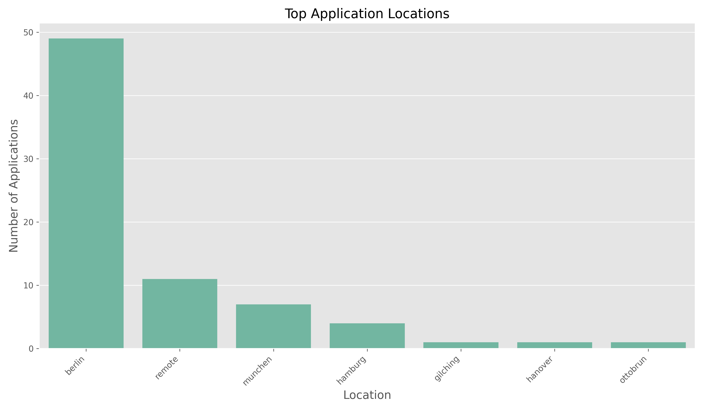

---

layout: single  
author: Huijo  
date: 2025-06-30
tags:  
   - Science
classes: wide  
title: "Real experiment over job search"

---
# My 3-Week Job Search Journey: A Data-Driven Reflection

With both a passion for data science and a need for a new career opportunity, I recently decided to document and analyze my job search process. Over a span of just three weeks (May 25 to June 17, 2025), I applied to 74 positions, primarily in AI/ML roles. To accomplish this volume efficiently, I leveraged an LLM-powered workflow I developed ([AI Cover Letter Generator](https://github.com/ccomkhj/AI-Cover-Letter-Generator)) that helped me generate tailored applications at scale. Here's what the data revealed about my experience, the job market, and what strategies proved most effective.

## The Application Sprint

My job search began with a burst of energy, submitting 74 applications in just three weeks. The timeline visualization shows my consistent effort, with slightly more applications submitted in the first week before leaving for holidays in the second week.

## Where I Applied

Berlin emerged as my primary target as I currently live in Berlin, accounting for 49 applications (66% of the total). I also submitted 11 applications to remote positions, recognizing the flexibility they offer, while exploring opportunities in other big and beautiful cities like München and Hamburg.

## What Roles I Pursued

My technical background led me to focus primarily on ML/AI Engineer roles (45 applications, 60.8% of total), with a significant number at the Senior Level (31 applications, 41.9%). I also targeted Data Scientist positions (16 applications, 21.6%), Software Engineer roles (8 applications, 10.8%), and more specialized positions in Data Engineering (6 applications, 8.1%), Robotics (4 applications, 5.4%), and Computer Vision (4 applications, 5.4%). I did not pursue strategic targeting within my areas of expertise as I have a broad expertise from my entrepreneurial journey and I wanted to feel the market. Note that many positions overlapped categories (e.g., "Senior ML Engineer"), which is why percentages sum to over 100%.

## Job Category Performance Analysis

I initially applied to a variety of roles to identify which categories would yield the best responses. The results were revealing:

The data visualization shows that while ML/AI Engineer positions yielded the highest number of successes (6.7%), Data Scientist roles had the highest interview rate (25.0%). Computer Vision Engineer positions also showed a strong interview rate (25.0%) despite the smaller sample size. Notably, Robotics Engineer positions had the highest rejection rate (75.0%), while Data Engineer positions had the highest "ghosting" rate (66.7%).

### Impact of Seniority Level

Interestingly, while senior-level positions generated a significantly higher interview rate (18.8% vs 9.5%) compared to non-senior roles, they also had a higher rejection rate and a lower conversion ghosting rate, suggesting that companies give more consideration and formal responses to senior applicants.

## Application Outcomes: The Raw Numbers

The initial statistics might look discouraging to some:

- 41.9% of applications resulted in rejection
- 40.5% received no response
- 17.6% led to the interview process

However, this seemingly modest success rate actually reflects the reality of today's competitive job market, where conversion rates are typically low.

## The Success Story Behind the Numbers

Looking deeper at the conversion rates tells a more encouraging story:

- **16.2%** of my applications were accepted for the interview process (it is lower than 17.6% above because some applications were on fast-track in process.)
- Of those accepted, **83.3%** led to a first interview (A few were rejected after filling questionnaire.)
- **60.0%** of first interviews progressed to second interviews
- **33.3%** of second interviews advanced to third interviews 
- Overall success rate was **12.2%** (including offers and applications I terminated at late stages)

## Timing Is Everything: How Long Each Stage Took

Understanding the timeline of the hiring process helped manage my expectations:

- **Application to acceptance:** 6.7 days on average (median: 6.0 days)
- **Acceptance to first interview:** 5.0 days on average (median: 3.0 days)
- **First to second interview:** 6.0 days on average (median: 1.5 days)
- **Second to third interview:** 2.0 days on average (median: 2.0 days)

The time-to-interview histogram shows that most companies responded within 5-15 days, with the quickest response being 4 days and the longest taking 19 days. 

## Effectiveness by Position Type

The heatmap visualization reveals interesting patterns about which roles yielded better results for me.

## Interview Success Rate Over Time

My interview success rate has been increasing similar over the three weeks as I start applying to the relevant roles.

## Key Takeaways

1. **Application-to-interview conversion is the critical hurdle**: Once I secured an interview, my chances of progression improved dramatically (40-50% advancement rates between interview stages). Catch the keyword from the job description, so hiring managers know you are fit.

2. **Quick turnaround times are the norm**: Most positive responses came within a week, suggesting that following up after 7-10 days of silence is a reasonable approach.

3. **Be prepared for high rejection and non-response rates**: Even with a successful search, 82% of my applications ended in rejection or silence before meeting a real interviewer.

## Conclusion

My three-week job search journey demonstrates the value of persistence, focus, and data-driven reflection.

The efficiency of my application process was significantly enhanced by my [LLM-powered workflow](https://github.com/ccomkhj/AI-Cover-Letter-Generator). This tool allowed me to generate custom cover letters while maintaining a high volume of submissions. The combination of AI assistance for scale and personal touch for quality proved to be an effective strategy.

For those currently in the job search trenches, I hope this analysis provides both realistic expectations and encouragement. The numbers may initially seem daunting, but with a strategic approach, modern tools, and persistence, success is achievable even in a competitive market.